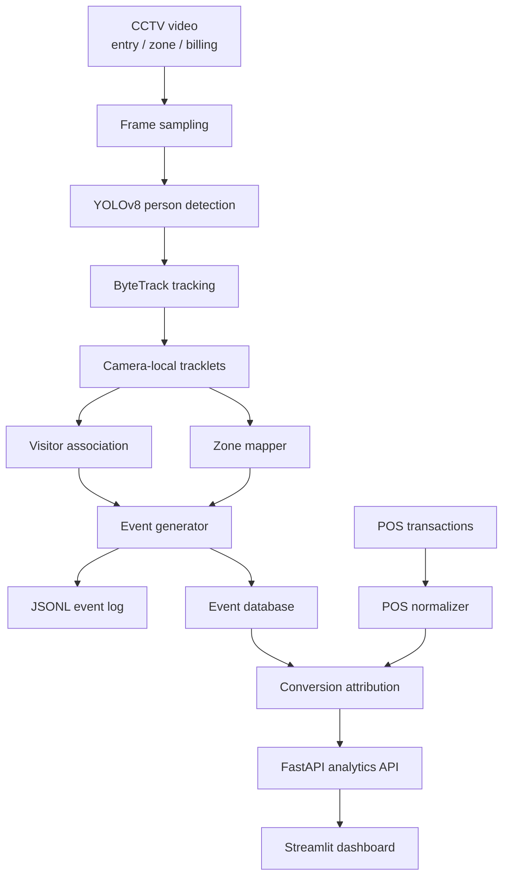

# DESIGN.md

## Problem Statement

The goal is to convert CCTV footage from physical retail stores into structured behavioral events, then use those events with POS transactions to compute actionable offline analytics.

The North Star metric is:

```text
Offline Store Conversion Rate =
converted_unique_visitors / total_unique_visitors
```

A converted visitor is inferred when a non-staff visitor is present in the billing zone within five minutes before a POS transaction.

## System Architecture



## Data Sources

The provided source files are stored under:

```text
data/raw/
```

Files:

```text
pos_transactions.csv
sample_events.jsonl
store_1.zip
store_2.zip
```

Key dataset observations:

- The POS file contains product-line order rows, not already aggregated basket transactions.
- The sample events use event-type-specific schemas.
- The store archives contain layout images and videos, not ready-made `store_layout.json` files.

## Event Log Design

The submitted event log follows the schema style demonstrated by `sample_events.jsonl`.

Required event families:

- `entry`
- `exit`
- `zone_entered`
- `zone_exited`
- `queue_completed`
- `queue_abandoned`

The event log deliverable is:

```text
submission/event_log.jsonl
```

## Event Lifecycle

1. Detect each person in sampled video frames.
2. Track each detected person within a camera.
3. Assign each camera-local track to a store-level visitor identity when confidence is sufficient.
4. Map bottom-center body position to store zones.
5. Generate entry, exit, zone, queue, and abandonment events.
6. Exclude staff from customer-facing metrics.
7. Attribute POS transactions to likely billing-zone visitors within five minutes.

## Staff Exclusion

Staff exclusion uses a conservative layered strategy:

- repeated long-duration presence
- behind-counter or staff-only movement patterns
- frequent reappearance across the day
- optional manual staff labels for calibration

Staff events may still be logged, but staff are excluded from conversion and visitor metrics.

## Re-Entry Handling

Visitors who leave and return within a configurable session window are treated as re-entries rather than new visitors when evidence supports the match.

Signals:

- time since exit
- entry camera track continuity
- appearance embedding similarity
- direction of movement
- store-level visitor history

## Edge Case Handling

Group entry:

- Generate one entry event per person track.

Occlusion:

- Use ByteTrack for short-term identity continuity.
- Degrade confidence when tracks are lost or re-linked.

Queue buildup:

- Track queue join, served, exit, wait time, and abandonment.

Empty periods:

- Emit no events and continue safely.

Camera overlap:

- Prefer entry cameras for unique visitor count.
- Suppress duplicate visitors using camera coverage and temporal association.

## API Design

The API exposes business metrics rather than raw CV internals.

Main endpoints:

```text
GET /health
GET /stores
GET /stores/{store_id}/events
GET /stores/{store_id}/metrics/conversion
GET /stores/{store_id}/metrics/dwell
GET /stores/{store_id}/metrics/heatmap
GET /stores/{store_id}/metrics/queue
GET /stores/{store_id}/metrics/summary
```

## Production Readiness

Production-readiness features:

- typed schemas
- JSONL event validation
- structured JSON logs
- Docker Compose plan
- configuration-driven thresholds
- pytest-based unit and integration tests
- confidence fields for uncertain decisions
- traceability from dashboard metric to event source

## AI-Assisted Decisions

AI assistance was used as a technical co-founder for architecture, risk analysis, and documentation. The final design decisions prioritize simplicity, robustness, and explainability.

### Decision: Use Events as Source of Truth

Why:

- Events are easier to validate than raw frame detections.
- Business metrics can be traced to auditable records.

Alternative:

- Compute metrics directly from detections.

Tradeoff:

- Requires careful event lifecycle design.

Impact:

- Improves event quality, API correctness, and explainability.

### Decision: Use YOLOv8 and ByteTrack

Why:

- Strong practical baseline for person detection and tracking.
- Easy to defend in interviews.

Alternative:

- Detectron2, DeepSORT, custom optical flow tracking.

Tradeoff:

- Not perfect under heavy retail occlusion.

Impact:

- Improves detection accuracy and implementation reliability.

### Decision: Normalize POS Before Attribution

Why:

- The provided POS file is product-line level.
- Conversion must be attributed at order level.

Alternative:

- Treat every POS row as a separate transaction.

Tradeoff:

- Requires grouping and timestamp parsing.

Impact:

- Prevents inflated conversion counts.

### Decision: Support Sample Schema Directly

Why:

- HackerEarth explicitly requires the event log to follow the provided sample schema.

Alternative:

- Submit only the canonical internal schema.

Tradeoff:

- Requires an adapter between internal events and submission events.

Impact:

- Reduces schema-format risk in the mandatory event-log deliverable.

