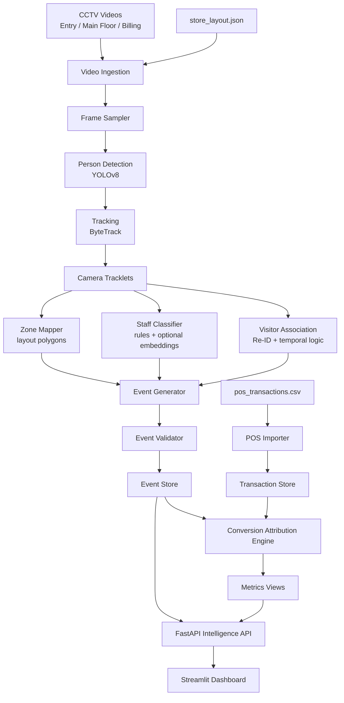

# Architecture

## Objective

Convert raw CCTV footage and POS transactions into validated behavioral events, then expose actionable business intelligence through APIs and dashboards.

The primary design goal is accurate and explainable offline conversion measurement.

## End-to-End Diagram



## Core Principle

Validated events are the source of truth, not raw detections.

This keeps business metrics traceable:

```text
video frame -> detection -> track -> visitor -> event -> metric -> dashboard
```

## Major Components

### Video Ingestion

Reads camera footage, normalizes timestamps, attaches `store_id` and `camera_id`, and applies configurable frame sampling.

Why chosen:

- Keeps inference cost manageable.
- Preserves original timestamps for POS attribution.

Alternatives:

- Full 15 fps processing.
- Event-only frame sampling.

Tradeoff:

- Lower fps improves speed but can miss very fast crossings. The default should be configurable.

Scoring impact:

- Strong production readiness and robustness.

### Person Detection

Uses YOLOv8 person detection.

Why chosen:

- Strong baseline accuracy.
- Easy to explain and fine-tune.
- Good ecosystem support.

Alternatives:

- YOLOv5, Detectron2, RT-DETR.

Tradeoff:

- YOLOv8 is not specialized for retail occlusion, but it is practical and challenge-friendly.

Scoring impact:

- Strong Part A score with high interviewability.

### Tracking

Uses ByteTrack for camera-local multi-object tracking.

Why chosen:

- Robust with low-confidence detections.
- Better suited to crowded scenes than naive centroid tracking.

Alternatives:

- DeepSORT, SORT, FairMOT.

Tradeoff:

- Track IDs may still switch under heavy occlusion, so event logic must tolerate short gaps.

Scoring impact:

- High impact on group entry, queues, and occlusion.

### Visitor Association

Maps camera-local tracks to global store-level `visitor_id`.

Signals:

- Time proximity
- Camera transition rules
- Zone continuity
- Appearance embeddings
- Re-entry window

Why chosen:

- Prevents double counting across cameras.

Alternatives:

- Count only from entry camera.
- Use face recognition.

Tradeoff:

- Appearance matching is imperfect without faces, so every association should carry confidence.

Scoring impact:

- Very high impact on conversion accuracy.

### Event Generator

Produces the required event types:

- ENTRY
- EXIT
- ZONE_ENTER
- ZONE_EXIT
- ZONE_DWELL
- BILLING_QUEUE_JOIN
- BILLING_QUEUE_ABANDON
- REENTRY

Why chosen:

- Matches challenge schema directly.
- Makes metrics auditable.

Scoring impact:

- High for Parts A, B, C, and D.

### Conversion Attribution

Links POS transactions to likely visitors in billing zone within the previous five minutes.

Ranking signals:

- Presence in billing zone
- Time proximity to transaction
- Queue order
- Track continuity
- Staff exclusion

Scoring impact:

- Highest direct impact on the North Star metric.

