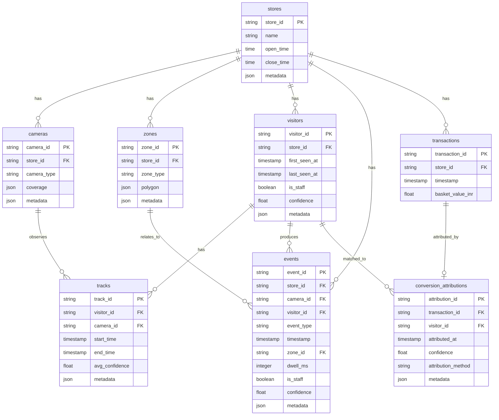

# Data Contract

## Event Schema

Every generated event must conform to this schema:

```json
{
  "event_id": "evt_001",
  "store_id": "store_001",
  "camera_id": "entry_cam_001",
  "visitor_id": "visitor_001",
  "event_type": "ENTRY",
  "timestamp": "2026-01-01T10:00:00Z",
  "zone_id": "entry_zone",
  "dwell_ms": null,
  "is_staff": false,
  "confidence": 0.92,
  "metadata": {}
}
```

## Event Types

```text
ENTRY
EXIT
ZONE_ENTER
ZONE_EXIT
ZONE_DWELL
BILLING_QUEUE_JOIN
BILLING_QUEUE_ABANDON
REENTRY
```

## Store Layout

`store_layout.json` defines:

- `store_id`
- open hours
- camera coverage
- zone polygons
- zone types

Zone membership should use the bottom-center point of the detected person bounding box.

## POS Transactions

Canonical internal columns:

```text
store_id
transaction_id
timestamp
basket_value_inr
```

The provided POS source file uses product-line order rows:

```text
order_id
order_date
order_time
store_id
product_id
brand_name
total_amount
```

The importer should normalize source rows into canonical transactions by grouping on `order_id` and summing `total_amount`.

## Conversion Rule

A transaction is attributed to a visitor if:

- same `store_id`
- visitor is not staff
- visitor was in billing zone
- visitor was observed within five minutes before transaction timestamp

When multiple candidates exist, choose the highest scoring candidate and store attribution confidence.

## Database Schema


