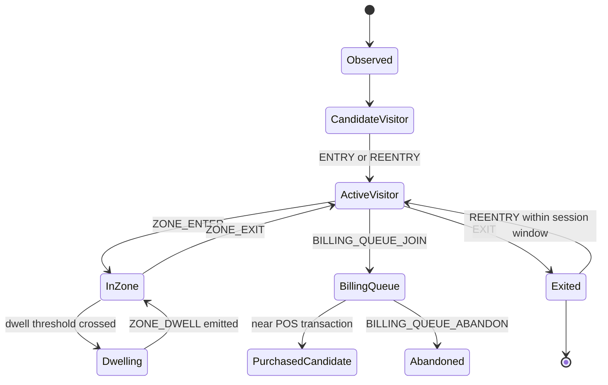

# Event Lifecycle

## Visitor State Machine



## Event Rules

### ENTRY

Generated when a non-staff visitor crosses the entry zone boundary inward.

### EXIT

Generated when a visitor crosses the exit boundary outward, or disappears near the exit zone with sufficient confidence.

### ZONE_ENTER

Generated when a visitor enters a defined polygon zone.

### ZONE_EXIT

Generated when a visitor leaves a defined polygon zone.

### ZONE_DWELL

Generated when a visitor remains in a zone beyond a configured threshold.

Default threshold:

```text
10 seconds
```

### BILLING_QUEUE_JOIN

Generated when a visitor remains in the billing queue zone beyond the queue join threshold.

Default threshold:

```text
5 seconds
```

### BILLING_QUEUE_ABANDON

Generated when a visitor leaves the queue without a linked transaction in the attribution window.

### REENTRY

Generated when a visitor exits and later returns within a configurable session window.

Default window:

```text
30 minutes
```

## Confidence Strategy

Confidence should degrade when:

- detection confidence is low
- track is recently occluded
- global visitor match is ambiguous
- camera overlap creates duplicate candidates
- POS attribution has multiple plausible visitors

Confidence should never be hidden. It is part of the explainability layer.

